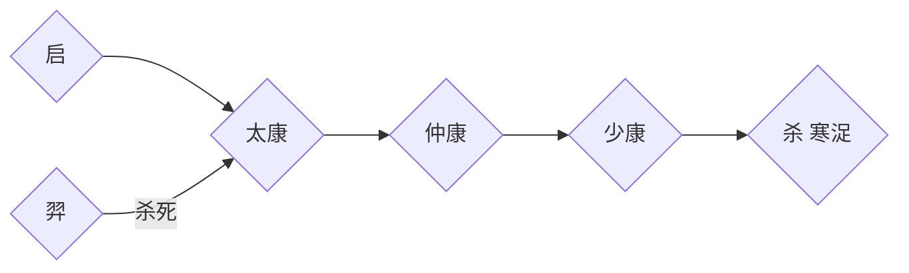

## 中国通史
盘古 女娲 共工  
有巢氏、燧人氏、伏羲氏（结网、打猎、饲养）、神农氏（药材、耕种）  
炎帝、皇帝（姬轩辕、有熊部落）.蚩尤（九黎部落）→后南迁为苗人  
尧、舜、禹→启  
桀（妹喜）  
400年后  

- 夏

- 商  汤→伊尹→→→→→→→→→→纣王
- 周  文王、武王 成王→康王（周公旦摄政）    成康之治
 厉王                                                周召共和
周幽王
- 春秋

>春秋五霸：  
齐桓公（鲍叔牙、管仲）  
晋文公、重耳  
秦穆公    霸西戎  
楚庄王    楚昭王杀伍子胥全家  
宋襄公  

楚兴：南方地广人稀、土地肥沃。  
齐宋、晋楚争霸，郑国子产，鲁(文化中心，弱国，制于齐)  
孔子、鲁班、公输般  
战国七雄：韩赵魏三家分晋，秦齐楚燕  

>魏国攻打赵国（齐国）  围魏救赵，桂陵之战  
韩魏攻打齐  
魏国攻打韩国（齐国）  退兵减灶，马陵之战  

- 秦国  
秦穆公→秦孝公   商鞅变法  
孝公卫鞅变法：民以十家或五家为一组。齐人隆技击，得一首赐锱金，事小敌脆则偷，事大敌坚则涣，亡国之兵也；魏……（体能测试，通过则永免赋税），税寡，危国之兵也。秦，生民也狭厄，使民也酷烈。厄而用之，得而功之，功赏相长也。  
楚怀王被张仪骗，与齐断交，被魏攻打  
齐灭宋，六国伐齐，燕昭王任乐毅伐齐  
长平之战，魏公子信陵君窃符救赵  

秦国贡献：
1. 确立“三公九卿”和“郡县制”
    - 三公：太尉（军事），丞相（行政），御史大夫（纪检）
    - “三公九卿”一直到隋朝被“三省六部”替代
    - “郡县制”：任命官员到地方上，不可世袭
2. 统一度量衡、文字、货币  
    - 书同文
    - 车同轨，修建“高速公路”，骨子里统一中国
3. 南征百越，北伐匈奴
    - 把秦、赵、燕长城连起来
4. 焚书坑儒

### 秦汉
- 楚汉相争  
西汉    汉高祖刘邦，汉惠帝（萧规、曹随，黄老之术）文景之治
- 七国之乱（周亚夫平定）  
汉武帝（刘彻）罢黜百家、独尊儒术。卫青、霍去病破匈奴，盐铁论  
汉昭帝    无为政治  
王莽  
刘秀  
- 三国  
司马懿→司马昭→司马炎  
- 隋    杨坚、杨广、杨素  
- 唐    李渊、李元吉、李世民  玄武门之变（尉迟、敬德）    贞观之治  
三省六部    武则天  

## 世界通史
埃及：上埃及，征服下埃及。美尼斯统一  
中王国   底比斯，“拉伸”变成“阿蒙神”  
      新王国    希克索斯人入侵（马与战车）  
两河：底格里斯河，幼发拉底河  

印度： 吠陀时代，种姓制度、婆罗门教：  
1、婆罗门----宗教祭祀。  
2、刹帝利----军权  
3、吠舍----农牧商，无政治权  
4、首陀罗----农牧渔猎，无宗教权。  

中国  

爱琴：克里特，希腊，荷马  

亚述王朝（闪米特人）  

巴比伦帝国  

波斯帝国  
希腊----斯巴达（最大的城邦，伯罗奔尼亚战争）  波斯与斯巴达战争    
马其顿（希腊北方）  腓力二世，亲马：波斯、掠夺财富  
腓力二世被刺，子亚历山大→东征波斯，大流士临阵脱逃→进入埃及  

罗马灭迦太基人，闪米特人仅剩犹太人   

### 罗马与汉帝国
罗马：高傲的塔克文，暴君  
罗马共和国  
罗马帝国：西西里奴隶起义  
格拉古兄弟改革  
斯巴达克斯起义  
三巨头：庞培，克拉苏 ，凯撒（高卢）。  
凯撒杀克拉苏，凯撒（第一皇帝遇刺）：屋大维、安东尼（埃及艳后）、雷必达  
孔雀帝国，佛教  

### 欧亚巨变------游牧民族大迁徙
公元3世纪  君士坦丁大帝   
公元5世纪 阿提拉  

西日耳曼人：撒克逊人、苏维汇人、法兰克人、阿勒曼尼人  
东日耳曼人：哥特人、汪达尔人、伦巴德人  
### 公元7,8,9世纪
隋唐盛世  
阿拉伯崛起：穆罕默德出现。拜占庭与波斯交战耗尽力量。阿拉伯帝国崛起  
罗马教皇的时代  
### 公元10世纪

五代十国、辽，西夏、金，北宋（赵匡胤陈桥兵变）、南宋（王安石变法）、契丹（辽）耶律阿保机

1214年蒙古 成吉思汗，窝阔台汗，蒙哥汗（让忽必烈成为中国皇帝）

印度----戎日王朝  
阿拉伯灭波斯  
东罗马帝国（君士坦丁堡、拜占庭）灭哥特  
玛雅  
阿兹特克：月神、雨神、花神、玉米神。  
印加文明  

圈地运动，文艺复兴，宗教改革  
奥斯曼兴起，拜占庭灭亡  
西班牙、葡萄牙  
英国打荷兰，英国打法国  
### 近代
英国资产阶级革命，美国独立战争，  
法国大革命，拿破仑（-1815）  
工业革命：飞梭→纺纱机（手摇→水力）→织布机→蒸汽机→火车  
（1804）铁路，（1835）电报，（1851）英法海底电缆  
德国统一（俾斯麦），打丹麦。丹麦、奥地利（奥匈帝国）、法国，组成德意志帝国。  
德国科技接手英法    
大清帝国，日本明治维新，美国对拉美、墨西哥  
第二次工业革命（电力）  
一战：德、奥匈、意大利vs英法俄（1914-1919）  
十月革命（1917）巴黎和约，凡尔赛-----华盛顿体系  

## 极简欧洲历史

### 希腊&马其顿&罗马
希腊文明1.0 米诺斯  
希腊文明2.0 迈锡尼文明（特洛伊战争）  
希腊文明3.0 雅典+斯巴达  

希腊vs波斯：希波战争  
- 第一次希波战争：**大流士**。陆军刚靠近希腊就被灭了，海军遇到飓风
- 第二次希波战争：**大流士**。 马拉松战役（一万打败十万）
- 第三次希波战争：**薛西斯**。斯巴达国王 **列奥尼达**，温泉关战役。火烧雅典。特米斯托克利：希腊海军打败波斯海军。

雅典vs斯巴达：伯罗奔尼撒战争  

马其顿崛起（亚历山大）：向东征服希腊、埃及、波斯、西亚、印度。  
亚历山大30岁死亡，帝国分崩。  

西方罗马崛起，征服希腊，继承了希腊文化。  
- 罗马王政：国王
- 罗马共和国：执政官+元老院
- 罗马帝国：独裁。**凯撒**，**屋大维**

罗马内战，**君士坦丁大帝** 胜出。分为西罗马+东罗马（拜占庭）  
- 东罗马继续活了一千年
- 西罗马不到一百年被灭。被日耳曼人取代（哥特人，法兰克人，汪达尔人，盎格鲁人，萨克逊人等）

### 中世纪
中世纪：西罗马灭亡到文艺复兴这一千年  
法兰克人：**查理曼大帝**  统一了日耳曼国家。  
查理曼三个孩子，把法兰克王国分为三份：西法兰克：法国，中法兰克：意大利，东法兰克：德国。  

- 德意志：众多诸侯，其中 **奥托大帝** 崛起，命名为 神圣罗马帝国（第一帝国，第二帝国时候普鲁士时代，第三帝国是希特勒时代）  
- 英法战争  
- 十字军东征（医院骑士团，圣殿骑士团，条顿骑士团）

### 文艺复兴
两件大事：
- 黑死病，文艺复兴
- 东罗马被土耳其灭了，陆上交通线断了，大航海时代开始
    - 葡萄牙人，向东绕过非洲好望角来到亚洲
    - 西班牙人，向西发现新大陆

### 革命
- 英国资产阶级革命
- 美国革命
- 法国大革命（路易十六被砍头）

拿破仑时代  
德意志崛起（**俾斯麦**，统一普鲁士和奥地利）  

一战：德国+奥匈帝国+意大利 vs 英国+法国+俄国

## 极简美国历史
五月花号，华盛顿  
波士顿倾茶，独立战争  

扩张：主要靠购买
- 向拿破仑购买路易斯安娜
- 向西班牙购买佛罗里达
- 怂恿德克萨斯独立后并入美国

南北战争  

打赢两次世界大战，成为超级大国

## 极简日本历史
### 大和部落
### 隋唐时代
飞鸟，奈良，平安（3个朝代，3个都城都是模仿唐朝）
### 幕府时代
源平之争（两个武士）  
镰仓幕府（元朝遇神风）  
室町幕府  
战国时代（织田信长->丰臣秀吉->德川家康）  
德川幕府
### 明治维新
