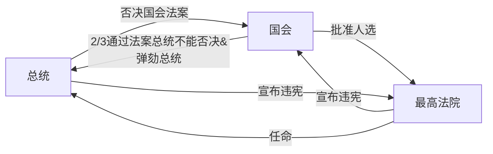

## 商鞅的经济政策
井田制：划分九个格子，周围8块田地产出归8户农奴，中间部分产出归贵族。  

废除井田制，承认土地私有，允许土地买卖。结果：  
1. 调动农民积极性。多劳多得。
2. 可以拥有土地。相当于鼓励开荒
3. 土地转移到高效率所有者身上。

坏处：贫富分化

好处
1. 以前的阶层是贵族、国人、农奴，现在农奴也变成国人了，兵源大大增加
2. 土地可以买卖，贵族阶级实际上消失了

## 汉朝的经济政策
### 文景之治
- 刚刚战争，贫富分化不剧烈
- 刚刚战争，人口较少，资源较多
- 文景黄老之术，不耗民力

### 汉武帝

- 推恩令，削弱豪强
  1. 让诸侯越来越小
  2. 激化长子与次子们的矛盾
- 罢黜百家，独尊儒术
- 扩大对外战争。尤其是一劳永逸解决匈奴问题。
- 收回盐铁经营权

黄老之术→汉武帝经济学
司马迁对商人的态度：善者因之，其次利导之，其次整齐之，最下与之争
儒、墨、道、法：墨太苦、法太臭、道太难。唯独儒家与下层宗教观念、孝悌相符，而且前提是有利于帝国组织的巩固。

### 王莽改革
1. 国营盐铁酒
2. 国家放款
3. 国家库存平价贸易
4. 荒弃土地收税
5. 无业游民收税
6. 所得税

（另一本书上写的王莽改革）
1. 试图搞计划经济（当然，底层老百姓不支持，也就无法禁止买卖）
2. 按照《周礼》多次更改货币、地名、外国名字。

## 政体
- 三权分立：立法权、司法权、行政权  
- 亚里士多德，政体三要素：议事权、行政权、审判权  
- 洛克《政府论》：立法权----议会。行政权、对外权----国王  

### 美国总统制：
总统、国会、最高法院  

## 英国内阁制
### 上议院
- 贵族院
    - 王室后裔、世袭贵族、新封贵族、上诉法院法官、教会
- 司法机关
    - 议长由大法官兼任，又是法律大臣

### 下议院
- 平民院、众议院
    - 选举产生
- 立法权、财政权、行政监督权  

提出议案→议会辩论→经三读通过→上议院→英王  

## 孙中山五权宪法
立法权、行政权、司法权、监察权、考试权  

平等和自由是天敌。少数人的自由和多数人的平等是矛盾的。  
